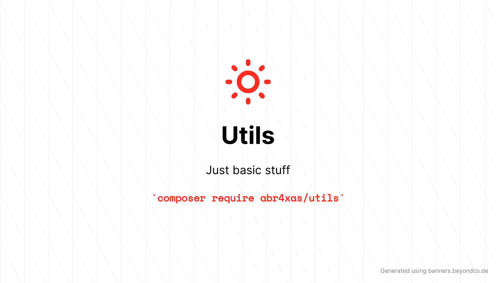

<p align="center">
	
</p>

# Utils

[](https://packagist.org/packages/abr4xas/utils)
[](https://github.com/abr4xas/utils/actions?query=workflow%3Arun-tests+branch%3Amaster)
[](https://packagist.org/packages/abr4xas/utils)
[](https://github.com/abr4xas/utils/network)
[](https://raw.githubusercontent.com/abr4xas/utils/master/LICENSE)


Un simple paquete de php que puede servir de utilidad a cualquiera con muchas herramientas que facilitan el desarrollo de proyectos mucho más rápido.

---


### how to install

```bash
composer require abr4xas/utils
```

Then:

```bash
$ composer update
$ composer dumpautoload -o // optional
```
### how to use

```php

<?php

require 'vendor/autoload.php';

use Abr4xas\Utils\SeoUrl;
use Abr4xas\Utils\Gravatar;
use Abr4xas\Utils\TimeFormat;
use Abr4xas\Utils\SuggestKeyword;
use Abr4xas\Utils\PrettyPrintArray;

$slug = SeoUrl::generateSlug('this is an awesome string');
// this-is-an-awesome-string

$gravatar = Gravatar::getAvatarUrl('email@domain.tld', ['s' => 80, 'd' => 'mm', 'secure' => true]);
// https://secure.gravatar.com/avatar/0b84841f9b6236d312515dc83046078c?s=80&d=mm&r=g

$timeAgo = TimeFormat::timeAgo('2020-08-25');
// 21 hours ago

PrettyPrintArray::prettyPrintArray($var);

$keywords = SuggestKeyword::SuggestKeyword('php');

PrettyPrintArray::prettyPrintArray($keywords);

// Output:

// Array
// (
//     [0] => php
//     [1] => phpmyadmin
//     [2] => php date
//     [3] => phpstorm
//     [4] => php online
//     [5] => php array length
//     [6] => php foreach
//     [7] => phpunit
//     [8] => php array
//     [9] => php try catch
// )
```


### random string generator usage

```php
<?php

use Abr4xas\Utils\RandomStringGenerator;

$token = (new RandomStringGenerator)->generate();

```

### custom alphabet

```php
<?php

$customAlphabet = '0123456789ABCDEF';

// you can set the custom alphabet from the constructor
$token = (new RandomStringGenerator($customAlphabet))->generate();

// or you can set a new alphabet whenever needed like this:

$token = (new RandomStringGenerator)->setAlphabet($customAlphabet)->generate();

```

## Testing

```bash
composer test
```

## Changelog

Please see [CHANGELOG](CHANGELOG.md) for more information on what has changed recently.

## Contributing

Please see [CONTRIBUTING](.github/CONTRIBUTING.md) for details.

## Security Vulnerabilities

Please review [our security policy](../../security/policy) on how to report security vulnerabilities.

## Credits

- [angel cruz](https://github.com/abr4xas)
- [All Contributors](../../contributors)

## License

The MIT License (MIT). Please see [License File](LICENSE.md) for more information.
